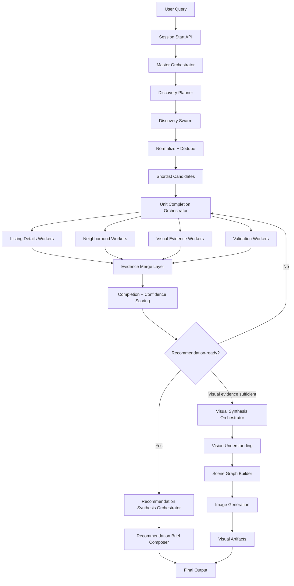

# Beacon Orchestrator Technical Plan

## 1. What the system is supposed to do

Beacon is an **AI rental advisor**.

The system takes a renter’s natural-language brief, searches broadly across rental sources, builds a structured source-of-truth record for promising units, recursively fills missing information through specialist agents, then synthesizes the best option into a polished recommendation brief.

Optionally, if there is enough visual evidence, Beacon also generates an **inferred visual preview** of the apartment.

So the system’s job is not just “search listings.”

It must:
- discover units
- collect evidence
- fill missing fields
- rank candidates
- compose a recommendation
- optionally generate visual outputs

---

## 2. High-level architecture



---

## 3. Main orchestration model

Use **one parent orchestrator** with **three child pipelines**.

### A. Master Orchestrator
Owns:
- session lifecycle
- high-level state
- worker dispatch
- stop conditions
- routing between phases

### B. Unit Completion Orchestrator
Owns:
- missing field detection
- recursive enrichment
- deciding which agent to run next

### C. Recommendation Synthesis Orchestrator
Owns:
- ranking
- reasoning
- tradeoffs
- final recommendation artifact

### D. Visual Synthesis Orchestrator
Owns:
- floor plan + photo understanding
- room mapping
- scene graph creation
- inferred image generation

This is cleaner than one giant orchestrator loop.

---

## 4. Core system principle

The system should be **goal-driven**, not purely sequential.

The goal for each promising unit is:

**complete the source-of-truth record until it is recommendation-ready**

That means the orchestrator asks:
- what do we already know?
- what is missing?
- which agent can fill that gap?
- is this unit complete enough to recommend?
- if yes, stop
- if no, keep dispatching targeted workers

---

## 5. Main system phases

### Phase 1: Session creation
User submits:

> Find me a 1-bedroom near Tanjong Pagar under S$3,800 with MRT access and good food nearby.

System actions:
- create `searchSession`
- store raw query
- parse into structured constraints
- initialize session state

Output:
- session ID
- parsed constraints
- status = `planning`

### Phase 2: Discovery planning
The system converts the query into **search slices**.

Examples:
- portal A, pages 1–2
- portal A, pages 3–4
- portal B, pages 1–2
- price bucket 2500–3200
- price bucket 3200–3800

The point is to search **widely and in parallel**.

Output:
- list of discovery tasks

### Phase 3: Wide discovery swarm
Launch many **discovery workers** in parallel.

Each worker:
- opens a portal/search slice
- applies search constraints
- extracts candidate listings
- returns rough structured summaries

Each result includes:
- title
- price
- listing URL
- source
- building/area text
- thumbnail
- basic visible metadata

Output:
- raw candidate listings from multiple workers

### Phase 4: Normalize and dedupe
All candidate results are normalized into one shared schema.

Then:
- dedupe repeated units
- resolve obvious field inconsistencies
- compute initial relevance score
- keep the most promising candidates

Output:
- normalized candidate pool

### Phase 5: Shortlist
The system chooses the top N units worth deeper work.

Typical hackathon scope:
- top 3 to 5 units

Only these units enter recursive completion.

Output:
- shortlist of unit records

### Phase 6: Recursive unit completion
For each shortlisted unit:
- create canonical unit record
- compute missing required fields
- dispatch only the agents that can fill those fields
- merge evidence
- rescore completeness
- recurse if needed

This is the heart of the architecture.

### Phase 7: Recommendation synthesis
When top units are complete enough:
- rank them
- choose best overall recommendation
- choose 1–2 alternatives
- generate why-selected explanation
- generate tradeoffs
- compose recommendation brief payload

Output:
- recommendation object

### Phase 8: Visual synthesis
If enough visual evidence exists:
- analyze floor plan
- analyze listing photos
- map photos to rooms
- build scene graph
- generate inferred preview images

Output:
- generated visual artifacts

### Phase 9: Final presentation
Frontend renders:
- main recommendation brief
- alternatives
- original source listing link
- optional inferred preview

---

## 6. Data model

### SearchSession

```ts
 type SearchSession = {
  id: string
  query: string
  constraints: QueryConstraints
  status:
    | "planning"
    | "discovering"
    | "shortlisting"
    | "enriching"
    | "synthesizing"
    | "generating_visuals"
    | "ready"
    | "partial_ready"
    | "failed"
  createdAt: number
}
```

### QueryConstraints

```ts
 type QueryConstraints = {
  area?: string
  budgetMin?: number
  budgetMax?: number
  bedrooms?: number
  propertyType?: string
  priorities?: string[]
}
```

### Candidate / UnitRecord

```ts
 type UnitRecord = {
  unitId: string
  sessionId: string
  status: "found" | "enriching" | "ready" | "partial" | "failed"

  required: {
    title?: string
    price?: number
    listingUrl?: string
    source?: string
    buildingName?: string
    areaText?: string
    beds?: number
    baths?: number
    keyImages?: string[]
    nearestMrt?: string
    amenitiesSummary?: string
  }

  optional: {
    sqft?: number
    furnishing?: string
    description?: string
    floorPlanUrl?: string
    exteriorImages?: string[]
    buildingContext?: string
  }

  evidence: {
    imageUrls: string[]
    sourceUrls: string[]
    fieldConfidence: Record<string, number>
    fieldSources: Record<string, string[]>
  }

  missingRequired: string[]
  missingOptional: string[]
  completionScore: number
  confidenceScore: number
  recommendationScore?: number
}
```

### RecommendationArtifact

```ts
 type RecommendationArtifact = {
  sessionId: string
  topUnitId: string
  alternativeUnitIds: string[]
  whySelected: string[]
  tradeoffs: string[]
  confidenceNotes: string[]
  neighborhoodSummary: string
  visualSummary?: string[]
  generatedPreviewUrls?: string[]
}
```

---

## 7. Agent architecture

### 7.1 Discovery Worker
Purpose:
- find candidate units quickly

Input:
- portal
- search slice
- filter constraints

Output:
- rough listing summaries

Best for:
- wide parallel search

### 7.2 Listing Details Worker
Purpose:
- deepen one listing page

Fills:
- sqft
- furnishing
- description
- image gallery
- floor plan
- building/address clues

### 7.3 Neighborhood Worker
Purpose:
- add location intelligence

Fills:
- nearest MRT
- food/grocery/gym/park signals
- convenience summary
- neighborhood notes

### 7.4 Visual Evidence Worker
Purpose:
- collect visual inputs for later synthesis

Fills:
- image URLs
- room image bundle
- floor plan URL
- exterior/building imagery

### 7.5 Validation Worker
Purpose:
- improve confidence and detect weak evidence

Fills:
- confidence adjustments
- missing data flags
- suspicious inconsistencies

---

## 8. Capability routing

The orchestrator should route by **missing field**, not by fixed sequence.

Example capability map:

```ts
const capabilityMap = {
  listingDetails: ["sqft", "furnishing", "description", "floorPlanUrl", "keyImages"],
  neighborhood: ["nearestMrt", "amenitiesSummary", "buildingContext"],
  visualEvidence: ["keyImages", "floorPlanUrl", "exteriorImages"],
  validation: ["fieldConfidence"]
}
```

If `nearestMrt` is missing, run `neighborhood`.
If `floorPlanUrl` is missing, run `listingDetails` or `visualEvidence`.
If `confidenceScore` is weak, run `validation`.

---

## 9. Recursive completion loop

This is how the system “keeps going” until a unit is complete enough.

```ts
async function enrichUnit(unit: UnitRecord): Promise<UnitRecord> {
  const gaps = detectMissingFields(unit)

  if (isCompleteEnough(unit)) {
    return { ...unit, status: "ready" }
  }

  const tasks: Promise<any>[] = []

  if (needsAny(gaps, ["sqft", "furnishing", "description", "floorPlanUrl", "keyImages"])) {
    tasks.push(runListingDetailsWorker(unit))
  }

  if (needsAny(gaps, ["nearestMrt", "amenitiesSummary", "buildingContext"])) {
    tasks.push(runNeighborhoodWorker(unit))
  }

  if (needsAny(gaps, ["keyImages", "floorPlanUrl", "exteriorImages"])) {
    tasks.push(runVisualEvidenceWorker(unit))
  }

  if (needsConfidenceRefresh(unit)) {
    tasks.push(runValidationWorker(unit))
  }

  const results = await Promise.allSettled(tasks)
  const merged = mergeEvidence(unit, results)
  const rescored = recomputeScores(merged)

  if (shouldStop(rescored)) {
    return finalizeUnit(rescored)
  }

  return enrichUnit(rescored)
}
```

---

## 10. Completion rules

Do not aim for perfect completeness.

### Required fields
Needed before a unit can be recommended:
- title
- price
- listing URL
- source
- area/building
- room count if visible
- key image(s)
- nearest MRT
- basic amenities summary

### Optional fields
Helpful but not blocking:
- sqft
- furnishing
- floor plan
- exterior images
- building context

### Stop conditions
Stop enriching a unit when:
- all required fields are filled, or
- completion score exceeds threshold, and
- confidence is above threshold, or
- retry/time budget is exhausted

Example:

```ts
function isCompleteEnough(unit: UnitRecord): boolean {
  return unit.missingRequired.length === 0 || unit.completionScore >= 0.8
}
```

---

## 11. Discovery architecture

The first pass should be **wide and parallel**.

### Discovery policy
- go wide cheaply
- go deep selectively

### Discovery swarm inputs
Split by:
- source portal
- page range
- neighborhood slice
- price bucket
- room type

### Why
This lowers latency and avoids sequential crawling.

### Discovery pseudocode

```ts
async function runDiscoveryPhase(session: SearchSession) {
  const slices = generateSearchSlices(session.constraints)

  const jobs = slices.map(slice => runDiscoveryWorker(slice))
  const raw = await Promise.allSettled(jobs)

  const normalized = normalizeDiscoveryResults(raw)
  const deduped = dedupeCandidates(normalized)
  const shortlisted = shortlistCandidates(deduped)

  return shortlisted
}
```

---

## 12. Master orchestrator flow

```ts
async function runBeaconSession(userQuery: string) {
  const session = await createSession(userQuery)

  session.status = "planning"

  const constraints = parseQuery(userQuery)
  await saveConstraints(session.id, constraints)

  session.status = "discovering"

  const candidates = await runDiscoveryPhase(session)

  session.status = "shortlisting"

  const topUnits = selectTopUnits(candidates, 3)

  session.status = "enriching"

  const enrichedUnits = await Promise.all(
    topUnits.map(unit => enrichUnit(unit))
  )

  session.status = "synthesizing"

  const recommendation = await synthesizeRecommendation(enrichedUnits, constraints)

  let visualArtifacts = null

  if (shouldGenerateVisuals(recommendation.topUnit)) {
    session.status = "generating_visuals"
    visualArtifacts = await runVisualSynthesis(recommendation.topUnit)
  }

  session.status = "ready"

  return {
    session,
    recommendation,
    visualArtifacts
  }
}
```

---

## 13. Recommendation synthesis architecture

This stage turns structured data into a user-facing recommendation.

### Inputs
- complete unit records
- completion/confidence scores
- user priorities

### Outputs
- top recommendation
- alternatives
- why selected
- tradeoffs
- confidence notes
- recommendation brief sections

### Pseudocode

```ts
async function synthesizeRecommendation(units: UnitRecord[], constraints: QueryConstraints) {
  const ranked = rankUnits(units, constraints)
  const topUnit = ranked[0]
  const alternatives = ranked.slice(1, 3)

  return {
    topUnit,
    alternatives,
    whySelected: buildWhySelected(topUnit, constraints),
    tradeoffs: buildTradeoffs(topUnit),
    confidenceNotes: buildConfidenceNotes(topUnit),
    neighborhoodSummary: summarizeNeighborhood(topUnit),
    visualSummary: summarizeVisualEvidence(topUnit)
  }
}
```

---

## 14. Visual synthesis architecture

This should be separate from unit completion.

### Goal
Generate an **inferred visual understanding** of the apartment, not an exact reconstruction.

### Inputs
- floor plan if available
- listing photos
- unit facts
- neighborhood/building context

### Steps

#### Step 1: visual evidence collection
Retrieve:
- listing image URLs
- floor plan
- exterior images
- room photos

#### Step 2: multimodal understanding
Use a model to extract:
- room types
- visible materials
- light direction
- camera angles
- likely layout clues
- unknowns

#### Step 3: room-photo matching
Map the photos to floor plan rooms.

#### Step 4: scene graph creation
Build a structured room graph.

#### Step 5: image generation
Generate:
- inferred living room preview
- inferred bedroom preview
- optionally a broader “what living here feels like” view

#### Step 6: attach to artifact
Store generated images and expose them in final output.

### Scene graph example

```json
{
  "rooms": [
    {
      "name": "living_room",
      "adjacent_to": ["kitchen", "balcony"],
      "photos": ["img2", "img5"],
      "visual_notes": "light wood floor, neutral walls, large window"
    }
  ],
  "unknowns": [
    "exact room depth unclear",
    "ceiling height unknown"
  ]
}
```

---

## 15. Backend architecture recommendation

If using Convex, a good structure is:

### Tables
- `searchSessions`
- `unitRecords`
- `workerRuns`
- `recommendationArtifacts`
- `activityLogs`

### Actions
- launch discovery swarm
- run listing detail workers
- run neighborhood workers
- run visual workers
- run visual synthesis

### Mutations
- create session
- upsert unit record
- merge worker results
- save recommendation artifact
- save generated images

### Queries
- get session state
- get shortlist
- get recommendation output

---

## 16. Frontend behavior

The frontend should consume orchestrator state, not worker details.

### During search
Optional live surface:
- subtle map
- candidate cards
- progress status

### Final state
Main output:
- single-page recommendation brief
- top recommendation
- alternatives
- source listing CTA
- optional inferred visuals

---

## 17. Failure handling

The system must degrade gracefully.

### Examples
- if floor plan missing → skip floor-plan-driven generation
- if neighborhood worker fails → still recommend with lower confidence
- if visual generation fails → still show recommendation brief
- if one portal fails → continue with remaining portals

### Principle
A missing enrichment should lower confidence, not crash the session.

---

## 18. Build order

### MVP
- session creation
- wide discovery swarm
- normalization + dedupe
- recursive unit completion
- ranking
- recommendation brief

### Next
- live results map
- visual evidence worker
- confidence notes
- alternatives section

### Stretch
- floor plan + image matching
- scene graph
- inferred image generation

---

## 19. One-sentence summary

**Beacon’s orchestrator system should run a wide parallel discovery swarm to find many candidate units quickly, recursively complete the top units by dispatching specialist agents for missing fields, then synthesize those completed unit records into a recommendation brief and optional inferred visual previews.**
